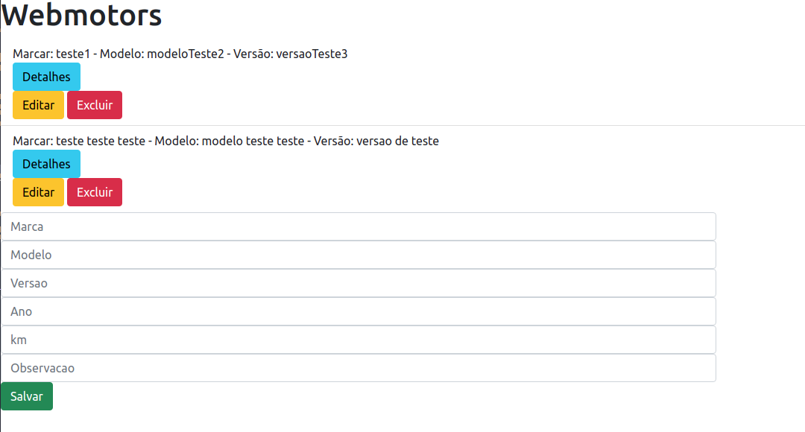

# Boas vindas ao repositório do desafio Webmotors
O código base do projeto está dividido em dois arquivos presentes nesse repositório:

No backend uma API utilizando Node.js e Express. Já o frontend foi elaborado com React.

## Backend

Considerações para instalar as dependências e colocar a API no ar.

### Requisitos necessários
* Node.js
* Servidor MySql rodando localmente 
> **NOTA:** As informações necessárias para conexão com o banco encontra-se no arquivo .env.example
### Instalação
* No ícone Code, baixe os arquivos fazendo um git clone ou utilizando o .zip
* Pelo terminal abra a pasta do projeto e acesse a pasta **backend**
* Crie um arquivo .env preenchendo-o como o arquivo **.env.example**
* Ainda na pasta do backend, pelo terminal, execute os seguintes comandos:
  * `npm install`
  * `npm start` (para o script de produção)
  * `npm run dev` (para o script de desenvolvimento)
Agora a API está pronta para receber requisições

### API
A API consiste em um serviço simples com alguns endpoints. 
Alguns que retornam a listagem das tarefas, outros atualização ou salvam as tarefas no banco de dados.

### Endpoints
A API apresenta cinco endpoints
* Um **GET** na rota /webmotors para retornar uma lista com todas os veículos armazenados no banco;
* Um outro **GET** na rota /webmotors/:id para retornar apenas um veículo com todas suas informações;

Exemplo:
  ~~~
  [
    {
      "ID": 8,
      "marca": "Honda",
      "modelo": "City",
      "versao": "2.0 EXL 4X4 16V GASOLINA 4P AUTOMÁTICO",
      "ano": 2018,
      "quilometragem": 0,
      "observacao": "Isso é um exemplo"
    }
  ]
  ~~~

* Um **POST** na rota /webmotors para adicionar um novo veículo ao banco de dados;
* Um **PUT** um na rota /webmotors/:id para atualizar as informações do veículo;
* Um **DELETE** na nota /webmotors/:id para deletar um veículo do banco de dados;

## Frontend
O frontend consiste em um projeto simples utilizando React, que renderizará o seguinte layout:

Trata-se de um frontend bem simples que vai se comunicar com a nossa API. Ele possui as seguintes funcionalidades:

* Uma tabela para exibição dos veículos retornados pela API;
* Um campo para adicinar um veículo com seus dados;
* Botões para ver detalhes do veículo, editar e excluir;

Todas essas funcionalidades estão divididas em alguns componetes:
* **AddVehicle** para adicionar um novo veículo;
* **VehicleDetails** para verificar mais detalhes sobre os veículos e possui o botão de detalhes;
* **VehicleList** que renderiza a lista de veículos;
* **VehicleUpdate** para editar as informações dos veículos e possui os botões de editar e excluir;

### Inicialização
* Pelo terminal abra a pasta do projeto e acesse a pasta **frontend**
* Execute o comando `npm install` para baixar e instalar as dependências
* Para abrir a aplicação digite o comando
  * `npm start`

